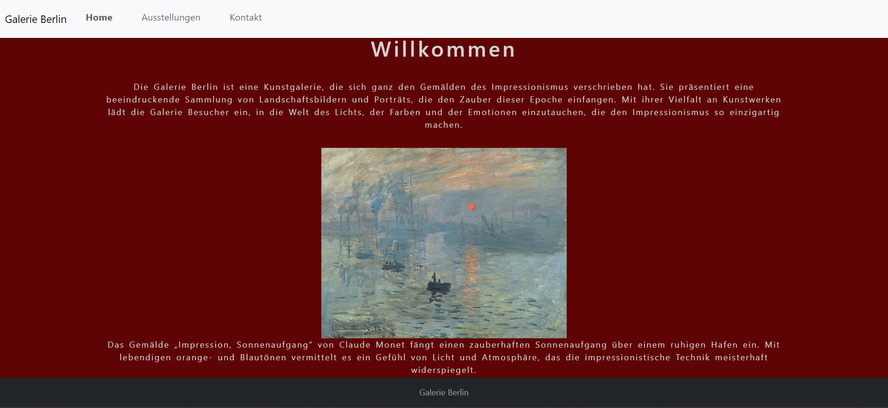
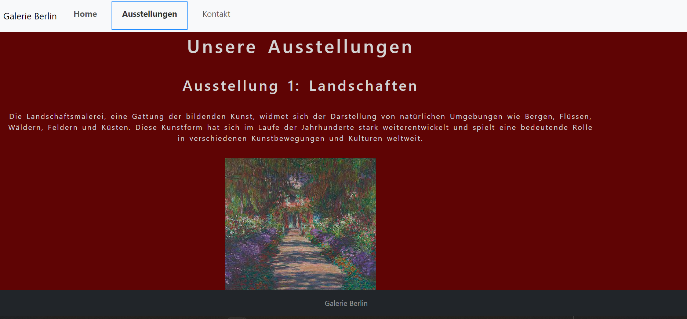
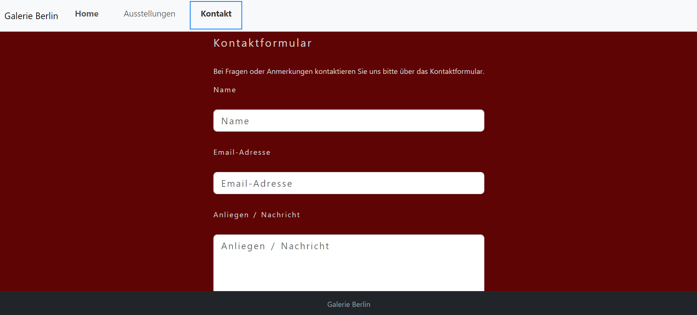

# ReadME.md

Barrierefreie Webentwicklung

Die Semesteraufgabe dieses Moduls war es, eine Webanwendung zu schreiben.
Aufgabe war es sich 6 Kriterien aus den Web Content Accessibility Guidelines (WCAG) 2.2. zu nehemn und diese zu Implementieren. 
Zusätzlich sollte das Projekt noch folgendes enthalten.

- Verwendung von Semantisches  Markup.
- Das Projekt ist über die Tastatur bedienbar.
- Die Sprache im Dokument ist angegeben.
- Ein Fokus-ring ist bei jedem Element sichtbar 
- Ein Skip-link ist Vorhanden, um Bereiche zu überspringen.

Die 6 WCAG 2.2. Kriterien

1. 1.1.1 Non-text Content
2. 1.4.3 Contrast (Minimum)
3. 3.2.3 Consistent Navigation
4. 2.5.5 Target Size (Enhanced)
5. 3.3.2 Labels or Instructions
6. 1.4.12 Text Spacing

Für mein Projekt habe ich mich dazu entschieden die Webseite einer Galerie zu erstellen.

## Homepage 
Hier erfährt man etwas über die Galerie.

## Ausstellungen
Diese Seite zeigt dem Besucher eine Übersicht über die Ausstellungen, die es in der Galerie gibt.

## Kontakt
Die Kontaktseite erlaubt es Besuchern mit der Galerie in Kontakt zu treten. 

## Installation 

Klone das Repository auf deinen lokalen Rechner.
git clone https://gitlab.rz.htw-berlin.de/Alice.Boeddinghaus/barfrei002.git

Führe dann im Terminal 'npm install' aus.

Danach 'ng serve'

Navigiere danach zu `http://localhost:4200/`. 

Das Frontend wurde mit Angular und Bootstrap entwickelt.

Bilderquelle: https://de.wikipedia.org/wiki/Claude_Monet
